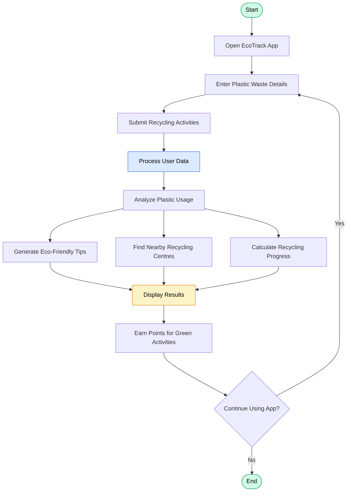

```mermaid
flowchart TD
    A([Start]) --> B[Open EcoTrack App]
    B --> C[Enter Plastic Waste Details]
    C --> D[Submit Recycling Activities]
    D --> E[Process User Data]
    E --> F[Analyze Plastic Usage]
    F --> G[Generate Eco-Friendly Tips]
    F --> H[Find Nearby Recycling Centres]
    F --> I[Calculate Recycling Progress]
    G --> J[Display Results]
    H --> J
    I --> J
    J --> K[Earn Points for Green Activities]
    K --> L{Continue Using App?}
    L -- Yes --> C
    L -- No --> M([End])

    style A fill:#d1fae5,stroke:#059669,color:#000
    style M fill:#d1fae5,stroke:#059669,color:#000
    style E fill:#dbeafe,stroke:#2563eb,color:#000
    style J fill:#fef3c7,stroke:#d97706,color:#000
```
